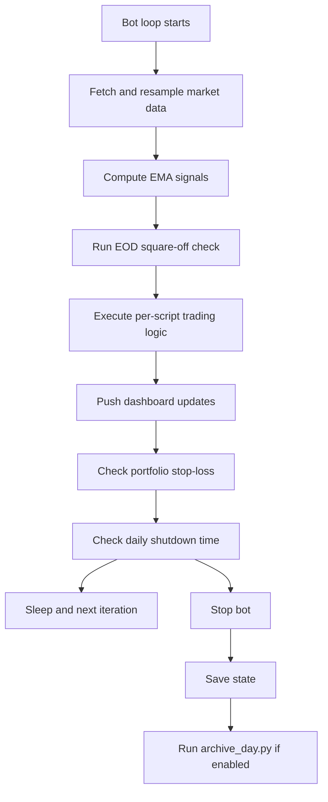

# Trading Bot Strategy Logic

This document explains the **live strategy flow** implemented in `trading_bot.py`.

## High-level runtime flow

## Entry logic

Entry is handled in `execute_trading_logic()` only when there is no open position for that script.

### Entry prerequisites

- Entry warmup must be complete (`allow_new_entries=True`).
- Must be within segment trading window:
  - after `entry_start_times[segment]`
  - before `eod_squareoff_times[segment]`
- Must be a fresh closed signal candle (no duplicate processing).
- Requires confirmed crossover (`entry_crossover=True`).

### Entry filters

- **EMA18 slope filter**
  - BUY: EMA18 must be rising
  - SELL: EMA18 must be falling
- **EMA separation filter**
  - `abs(EMA5 - EMA18) / EMA18 * 100 >= min_ema_separation_percent`
- **Swing SL validity**
  - BUY: swing SL must be below entry
  - SELL: swing SL must be above entry

### Position fields initialized

- `type` (`BUY`/`SELL`)
- `entry_price`, `entry_time`, `quantity`
- `initial_sl`, `stop_loss`
- `target_price`
- `trail_steps_locked=0`, `breakeven_done=False`
- `trade_id` for dashboard events

---

## Exit logic (priority order)

When a position is open, checks are applied in this order:

1. **Stop-loss hit**
2. **Target hit**
3. **Order-block breach / opposite crossover**

If any exit condition succeeds, position is closed and removed immediately.

### 1) Stop-loss hit

- BUY exits if `current_price <= stop_loss`
- SELL exits if `current_price >= stop_loss`

### 2) Target hit

- Uses favorable move percent from entry:
  - BUY favorable move = `(current - entry)/entry * 100`
  - SELL favorable move = `(entry - current)/entry * 100`
- Exit when favorable move >= `target_percent`

### 3) OB breach / opposite crossover

- Uses last closed candle close against OB boundary (`initial_sl`)
- BUY OB breach: candle close < OB boundary
- SELL OB breach: candle close > OB boundary
- Opposite crossover exit triggers on confirmed opposite crossover

---

## Stop-loss and trailing stop-loss

Trailing logic is in `_update_position_sl()`.

### Rule set

- Initial risk is derived from `entry_price` and `initial_sl`.
- At breakeven trigger:
  - SL moves to entry price (cost)
- Beyond breakeven:
  - SL moves in steps based on favorable move

### Configuration

- Default trail settings:
  - `trailing_stop_loss_percent`
  - `trail_step_percent`
- Script-level overrides supported via:
  - `trailing_overrides_by_script[script]`
  - `breakeven_trigger_percent`
  - `trail_step_percent`

### Locking behavior

- BUY: SL only moves upward (`max`)
- SELL: SL only moves downward (`min`)
- `trail_steps_locked` prevents repeated updates at same step

---

## EOD square-off logic

Handled by `_run_eod_squareoff(now_ist, latest_prices)`.

- Segment-level cutoff times from `eod_squareoff_times`
- For each open position in due segment:
  - Place market close order
  - Log `EOD_SQUAREOFF`
  - Remove position
- Marks completion in `eod_squareoff_done[segment]=today`

---

## Daily shutdown and archiving

After configured `daily_shutdown_time` (IST):

- Bot stops loop
- Saves state
- Runs `archive_day.py` if `auto_archive_on_shutdown=True`
- Archives logs/state/cache into dated folder under `archive/`

---

## Scenario summary

| Scenario | Trigger | Action |
|---|---|---|
| New BUY entry | Confirmed bullish crossover + filters pass | Place BUY, set initial SL + target, create position |
| New SELL entry | Confirmed bearish crossover + filters pass | Place SELL, set initial SL + target, create position |
| SL hit (BUY) | Price <= SL | Place SELL exit, remove position |
| SL hit (SELL) | Price >= SL | Place BUY exit, remove position |
| Target hit | Favorable move >= target% | Exit and remove position |
| Trailing update | Favorable move crosses step thresholds | Move SL toward profit direction |
| OB breach | Closed candle violates OB boundary | Exit and remove position |
| Opposite crossover | Confirmed opposite crossover | Exit and remove position |
| EOD square-off | Segment cutoff reached | Exit all open positions in segment |
| Daily auto shutdown | `now_ist >= daily_shutdown_time` | Stop bot and archive runtime artifacts |

---

## Notes

- Strategy decisions intentionally use **confirmed closed-candle context** for entry signals.
- Dashboard receives open/update/close events from bot helper methods.
- Weekday P&L chart data is computed from order logs via dashboard API.
